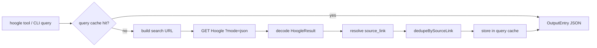
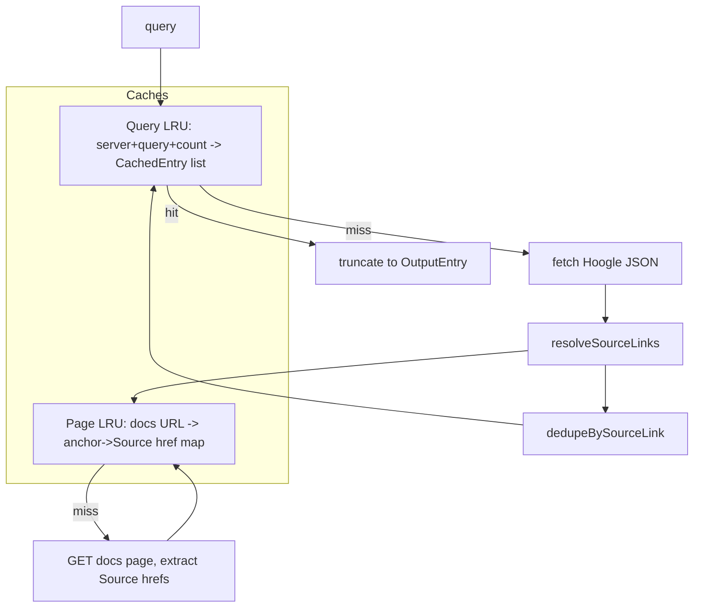

# wire-hoogle-mcp

A Haskell MCP server (stdio) and CLI exposing a single `hoogle` tool for
Haskell API lookup. It queries the Wire Hoogle instance by default and the
general instance on request. Results are compact JSON.

## Usage

As an MCP server it speaks JSON-RPC over stdio and is wired into the
`wire-server-haskell-dev` harness by `harnesses/parts/hoogle-mcp.nix`:

```sh
nix develop .#wire-server-haskell-dev   # opencode with the hoogle tool + subagent
nix build .#wire-server-haskell-dev     # installable harness
```

Standalone CLI:

```sh
nix build .#wire-hoogle-mcp
./result/bin/wire-hoogle-mcp query "map +base" --count 5
./result/bin/wire-hoogle-mcp query "a -> a" --full-docs
./result/bin/wire-hoogle-mcp query "parseEither" --general
```

`query` is a Hoogle query, not a plain search: a name (`map`), a type
(`a -> a`), or combined `name :: type`. Scope with bare filters:
`+packagename`, `-packagename`, `+Module.Name`. Options: `--count N`
(clamped 1..50, default 10), `--full-docs`, `--general`. Running the binary
with no subcommand starts the MCP server.

Environment variables:

| Variable                   | Default                      | Purpose                    |
| -------------------------- | ---------------------------- | -------------------------- |
| `WIRE_HOOGLE_URL`          | `https://hoogle.zinfra.io`   | Wire instance base URL     |
| `GENERAL_HOOGLE_URL`       | `https://hoogle.haskell.org` | General instance base URL  |
| `HOOGLE_CACHE_MAX_ENTRIES` | `5000`                       | Capacity of each LRU cache |

## Architecture

A query is fetched, its per-entry source links resolved from the Haddock docs
pages, then de-duplicated before being served:



Two LRU caches back a session. The query cache avoids repeating a search; the
page cache avoids re-fetching a docs page while resolving source links. Empty
page maps are not cached, so a transient fetch failure is retried next time
rather than pinned for the session.



Source links cannot be derived by munging the docs URL: a re-exported name
(e.g. base's `Control.Monad.forever`) is defined elsewhere (ghc-internal), so
a munged `src/Control.Monad.html#forever` link is dead. Instead the docs page
is fetched and the `Source` href Haddock renders next to the item's anchor is
extracted. Wire serves these as `file//nix/...`; repeated slashes are
normalized so cross-package re-exports compare equal.

## Output

A JSON array; each element:

| Field               | Meaning                                                           |
| ------------------- | ----------------------------------------------------------------- |
| `package`, `module` | matched package / module                                          |
| `item`              | signature                                                         |
| `docs`              | documentation, truncated to ~500 chars unless `full_docs`         |
| `docs_truncated`    | whether `docs` was truncated                                      |
| `link`              | mangled docs URL (null if absent)                                 |
| `source_link`       | real definition (null if not derivable)                           |
| `type`              | null for functions, `"module"`/`"package"` for those entries      |
| `also_in`           | other `package/module` locations re-exporting the same definition |

```json
[
  {
    "package": "base",
    "module": "Prelude",
    "item": "map :: (a -> b) -> [a] -> [b]",
    "docs": "The map function...",
    "docs_truncated": true,
    "link": "https://hoogle.zinfra.io/.../Prelude.html#v:map",
    "source_link": "https://hoogle.zinfra.io/file/nix/store/.../GHC.Base.html#v:map",
    "type": null,
    "also_in": ["base/Data.List", "base/GHC.Base"]
  }
]
```

Results are de-duplicated by `source_link`, so `count` is a maximum, not a
guarantee. The matched `module` is the first re-exporting module, not
necessarily the canonical one; the real definition is in `source_link`.

## Build and test

```sh
nix build .#wire-hoogle-mcp
nix develop .#wire-hoogle-mcp --command cabal test --offline
```
